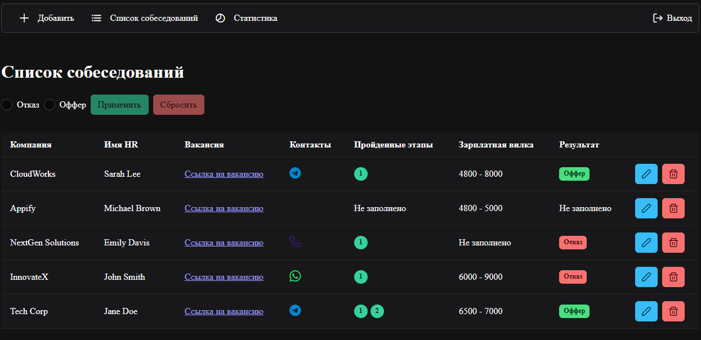

# Interview List

[Demo](https://deniskulik.github.io/interview-list/)

## Built With
This project is built using `TypeScript`, `Vue`, `Pinia`, `Vue Router`, `Firebase`, `PrimeVue`, `Vite` and `Chart.js`.

## Screenshots

## Description
Interview List is an app designed for users who are going through job interviews. It allows you to store detailed information about your interviews, track progress, and view statistics on your performance, helping you stay organized and prepared throughout the interview process.